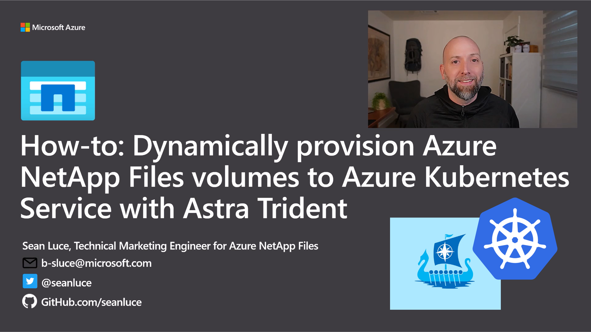

# How-to: Dynamically provision Azure NetApp Files volumes to Azure Kubernetes Service with Astra Trident

In this repo you'll find the supporting JSON and YAML files to complete the how-to as outlined in this video: https://youtu.be/3uIu0C5WOfw




All of the commands used in the video are shown below for easy cutting and pasting in to Aure cloud shell.

1. From within Azure Cloud Shell, clone this repo

```
git clone https://github.com/seanluce/ANF_Trident_AKS.git
```

2. Deploy and connect to your Azure Kubernetes Service (AKS cluster)

3. Add the Astra Trident helm repo

```
helm repo add netapp-trident https://netapp.github.io/trident-helm-chart
```

4. Install Astra Trident with helm install

```
helm install trident netapp-trident/trident-operator --version 23.01.0 --create-namespace --namespace trident
```

5. Download the Astra Trident installer package and extract to get 'tridentctl'

```
wget https://github.com/NetApp/trident/releases/download/v23.01.0/triednt-installer-23.01.0.tar.gz

tar -xf trident-installer-23.01.0.tar.gz
```

6. Make sure you have an Azure NetApp Files delegated subnet created

7. Deploy the Astra Trident backend (you will need to modify this file to fit your environment)

```
tridentctl -n trident create backend -f anf_backend.json
```

8. Create your storage class

```
kubectl apply -f anf_sc.yaml
```

9. Create your persistent volume claim (PVC)

```
kubectl apply -f anf_pvc.yaml
```

10. Verify the Azure NetApp Files volumes was created

11. Create you NGINX deployment

```
kubectl apply -f ngninx_deployment.yaml
```

12. Confirm your deployment

```
kubectl get deployment
kubectl get pods
kubectl describe pod <yourPodName>
```

13. Expose your service and give your deployment a public IP address

```
kubectl expose deployment nginx-anf-trident --port=80 --type=LoadBalancer
```

14. Get your public IP address

```
kubectl get svc
```

15. Set the correct permissions on /usr/share/nginx/html (this step is optional if you set volume permissions as part of the backend configuration)

```
kubectl exec -it <yourPodName> -- chmod 755 /usr/share/nginx/html
```

16. Create a sample index.html file or use the one provided and copy it to your Azure NetApp Files volume that is mounted on the running pod

```
kubectl cp ./index.html <yourPodName>:/usr/share/nginx/html/
```

17. Point your web browser to you public IP address and see your new web app!

